## Online Community research platform(在线社区调研平台端)
- Fill in the basic building information, rental data and vacancy information released by the government online.
- 在线填写政府发布的楼宇基本信息与出租数据、空置信息。

## Technology use
- Development language：Vue 2.0

## Picture display

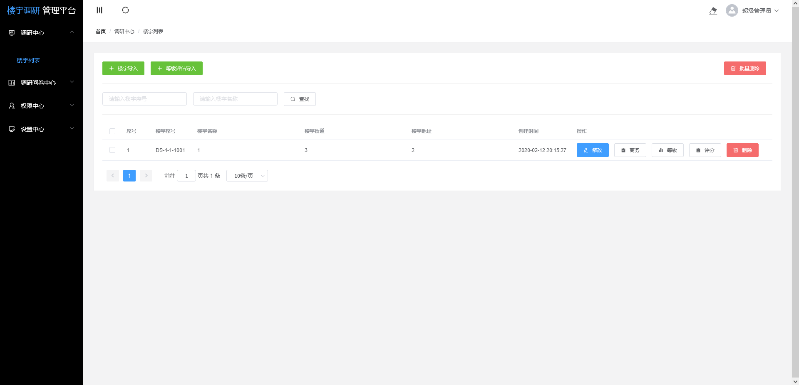
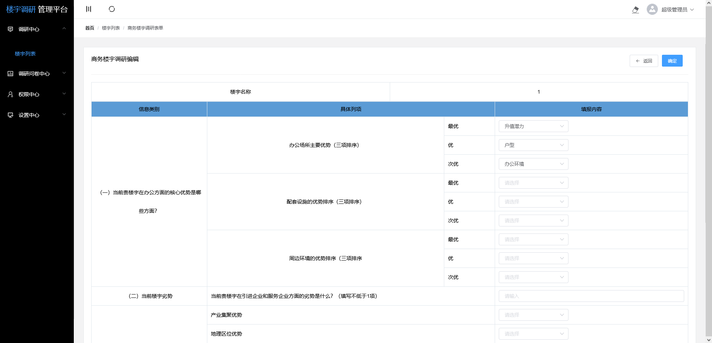
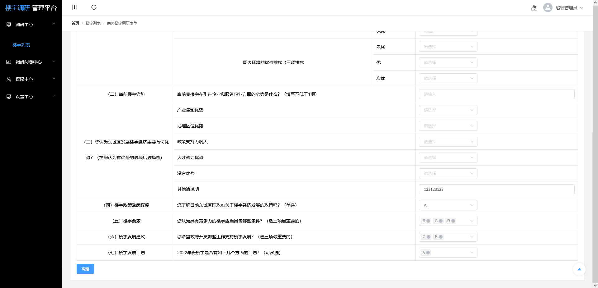
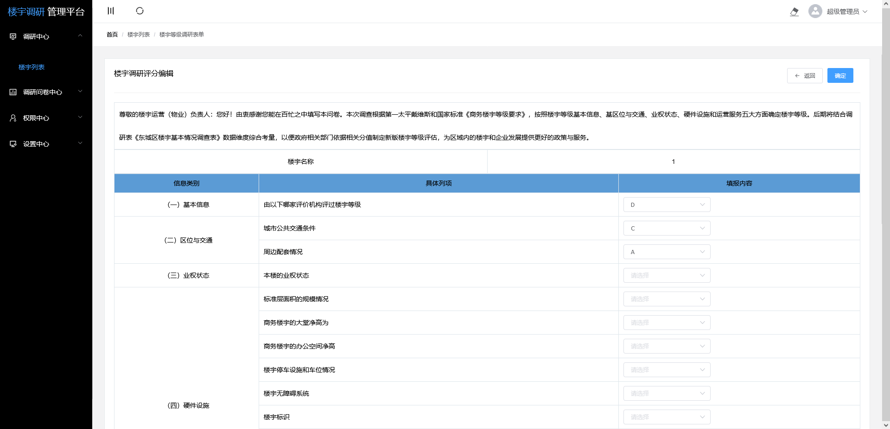
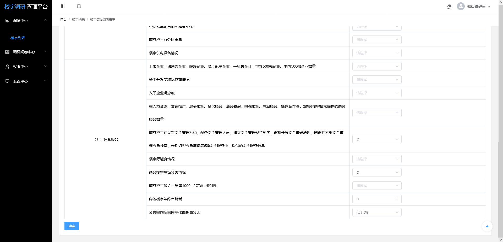
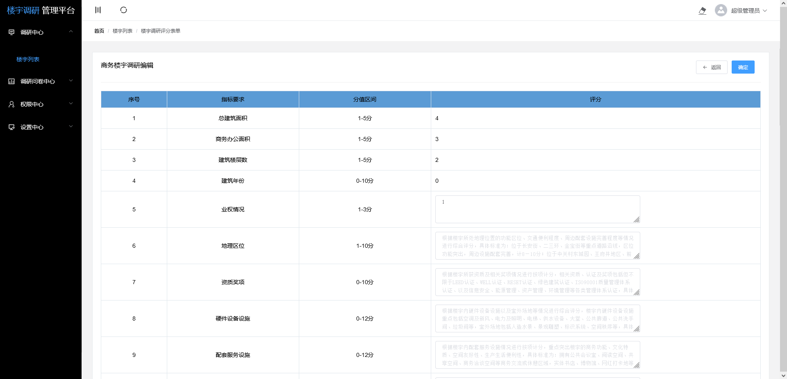
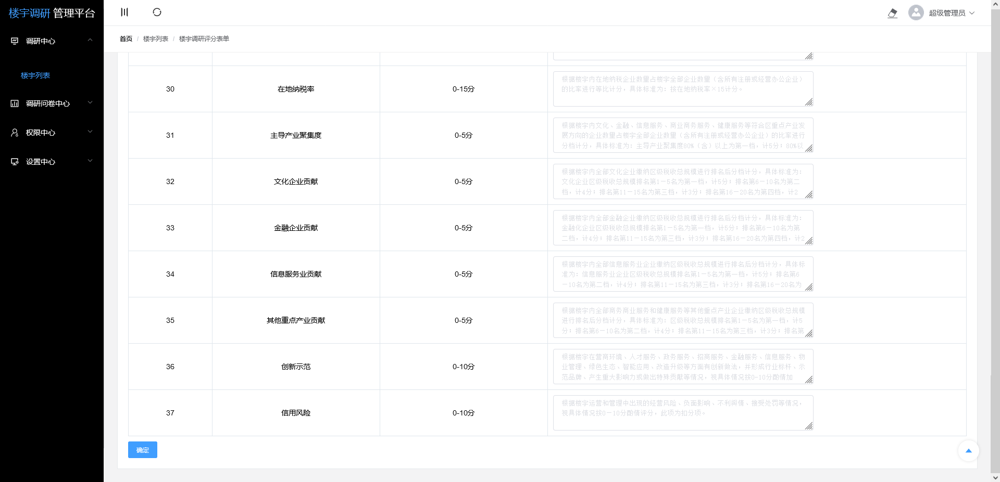
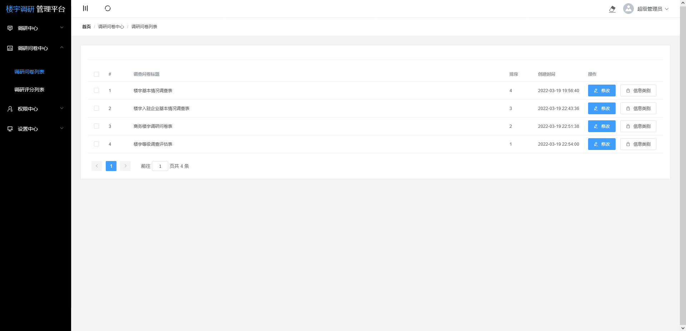
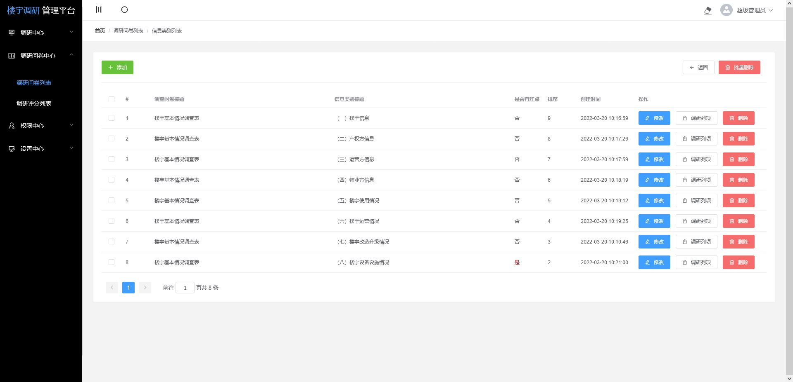
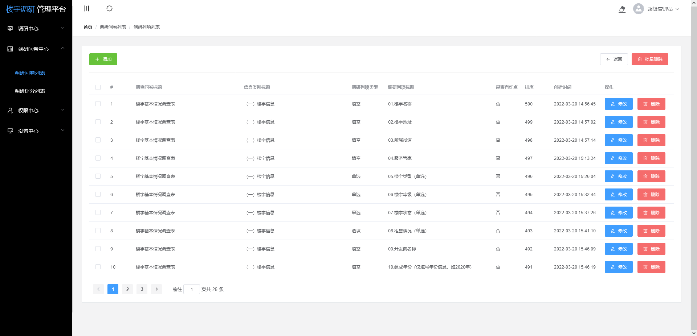
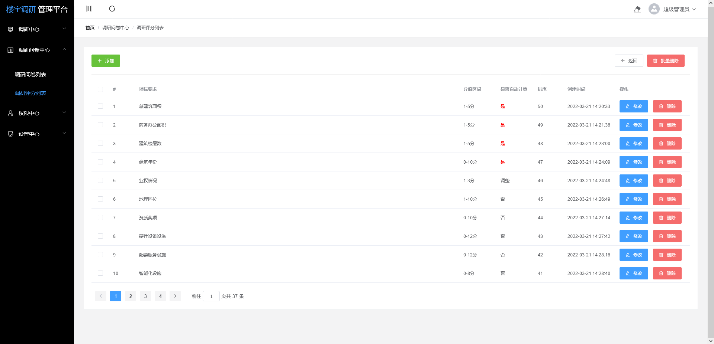

### Find for remote work or collaboration
I possess 12 years of experience in PHP development, 5 years of full-time outsourcing service experience, and 3 years of Python development experience.  I am currently seeking part-time, remote work opportunities.  Please feel free to contact me if you believe my background aligns with your requirements.

### 寻找远程工作或者合作
我是一位12年PHP开发经验，5年全职外包服务经验，3年python开发经验。现在寻找兼职工作、远程工作、驻场工作机会。 感觉合适的话随时联系。

### Contact way
- Email: 1326336909@qq.com
- Wechat: zxf5115
